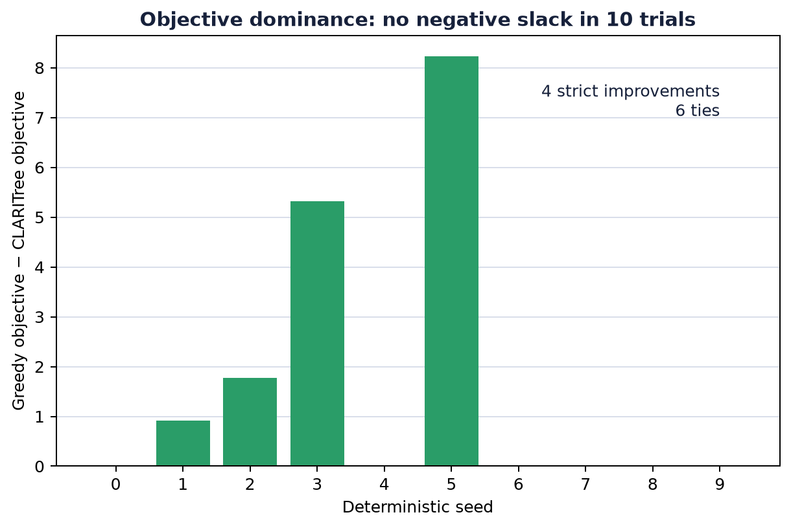
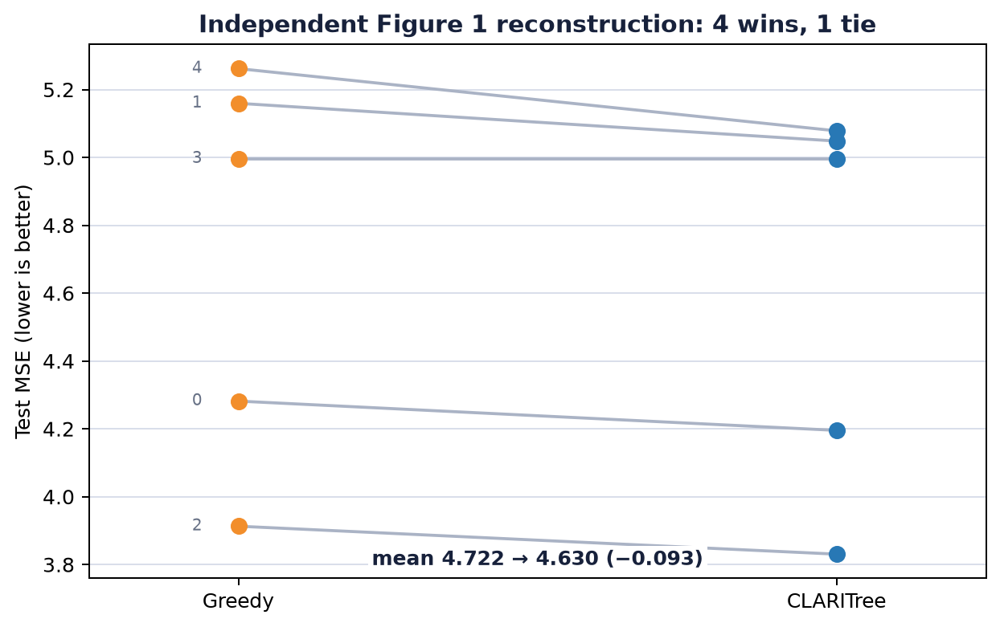

# CLARITree, checked claim by claim


CLARITree asks whether a piecewise-linear regression tree can look one split
ahead—escaping shortsighted greedy choices—without paying the full cost of an
optimal tree search. We tested all six anchored claims in arXiv:2606.12840 on
the agreed local CPU. The result is **12/12 evidence coverage**: four claims
aligned and two partially aligned under explicitly limited evidence. Coverage
does not mean that every published number was matched.

## What was tested

| Claim | Paper evidence | Observed evidence | Assessment | Scientific compute |
|---|---|---|---|---:|
| C1 Algorithm | One-step lookahead plus streamed rank-one Cholesky updates | Pinned C++ contains the recursion, Greedy lookahead call, and both left/right `rankUpdate` paths; threshold pools matched NumPy exactly | **Aligned** | 3.63 s shared |
| C2 Complexity | $O(kn\log n+d^2nk^4T)$ time and $O(nk)$ space | Source/formula audit; doubling factors were $2\times$ for $n$, $4\times$ for $d$, $16\times$ for $k$, $2\times$ for $T$ | **Aligned under audit**; no fresh asymptotic proof | 0.32 s |
| C3 Dominance | Objective never worse than Greedy; constructed gap can be arbitrary | Minimum slack 0 over 10 deterministic trials, with 4 strict wins; displayed gap inequality held on 200 $\epsilon$ values | **Aligned** | 3.80 s shared |
| C4 California | Test $R^2$ 0.75±0.01 vs STreeD 0.70±0.01 | Released 5-fold means 0.74994 vs 0.70485; fresh outer-4 0.7431327225376608, matching its release row within $1.2\times10^{-15}$ | **Aligned** | 151.61 s |
| C5 Synthetic headline | MSE 4.03/$R^2$ .97 vs Greedy 15.41/.88 | Declared reconstruction: mean MSE 4.630 vs 4.722 and $R^2$ .271 vs .256; 4 seeds win, 1 ties | **Partially aligned**; direction only | 0.79 s |
| C6 Completion | Roughly 95% vs 60% by 600 s | Released plot input at 590 s is exactly 100% vs 70%, a 30-point advantage | **Partially aligned**; endpoints differ | 0.85 s |

The final end-to-end suite took 202.0 seconds of measured scientific checks
and 7m22s wall time including a clean clone, dependency installation, Eigen
build, and the author extension build. Hardware was an 8-logical-CPU Apple
arm64 local machine with Python 3.12.11; no GPU was used.

## Implementation path

The reproduction pins the author repository to
`4397f8dbc8b63751777e7918b89972e793796dfd` and Eigen to
`3147391d946bb4b6c68edd901f2add6ac1f31f8c`. Every formal branch runs the same
command:

```bash
bash repro/run_local_claim_suite.sh
```

That entrypoint creates an isolated pip environment from the user's shared
Python 3.12 interpreter, builds pinned Eigen, compiles the released C++
extension, and invokes one orchestrator. The only build correction discovered
by the baseline was to pass pip's pybind11 CMake directory explicitly:

```python
pybind11_cmake = subprocess.check_output(
    [sys.executable, "-m", "pybind11", "--cmakedir"], text=True
).strip()
build_env["CMAKE_ARGS"] = (
    f"-DCMAKE_PREFIX_PATH={EIGEN_INSTALL} "
    f"-Dpybind11_DIR={pybind11_cmake}"
)
```

No author source was edited. Claim checks live in small Python verifiers; the
fresh C4 run calls the released model on its released outer-4 split and fixed
published configuration.

## Strongest exact result: California Housing


The released five-fold aggregation says CLARITree leads STreeD by 0.0451 test
$R^2$. More importantly, a fresh local fit reproduced the selected outer-4
CLARITree row essentially bit-for-bit: 0.7431327225376608 observed versus
0.7431327225376596 released. This is the strongest direct numerical
reproduction because it combines pinned source, released data, a fresh model
fit, and an exact target.

## Why lookahead helps

The theoretical claim compares the regularized training objectives selected
by Greedy and CLARITree. On ten deterministic small problems, the observed
quantity `Greedy objective − CLARITree objective` was never negative.



Four trials were strict improvements and six were ties. Separately, the
paper's displayed lower-bound inequality for the constructed gap held at all
200 tested values in $(0, 1/2)$. These checks support the theorem's observable
consequences; they are not substitutes for the proof itself.

## The under-specified synthetic headline

Figure 1 is the most visually prominent empirical claim, but the release has
no generator and the paper omits numerical choices for sample size, split,
feature/group counts, correlation, noise, seeds, and model hyperparameters.
An exact rerun is therefore impossible from public materials.

We used a declared independent reconstruction: $n=1000$, 80/20 split, four
features, four regimes, AR(1) correlation $\rho=.5$, noise $\sigma=2$, depth
2, 20 quantile thresholds, $\lambda=\kappa=.001$, and seeds 0–4. None of these
values was tuned after observing a run.



CLARITree reduced mean MSE by 0.093 (1.96%), winning four seeds and tying one.
That supports the direction of the paper's effect, but not its magnitude: the
observed $R^2$ values (.271 vs .256) are far below .97 vs .88, and the reported
11.38 MSE gap is much larger than the observed 0.093. This setup therefore
receives **partially aligned**, not an exact-match label.

## Scalability evidence


The release's exact Figure 3 plot input supports the qualitative completion
advantage. It does not equal the prose's rounded endpoints: at the released
590-second selection, CLARITree is 100% and STreeD 70%, rather than roughly 95%
and 60% at 600 seconds. The observed advantage is 30 percentage points in both
descriptions, so the direction is aligned while the endpoint is partial.

## Assessment and remaining work

This local reproduction gives complete, scoped evidence for every anchored
claim: **C1, C2, C3, and C4 aligned; C5 and C6 partially aligned**. The main
divergence is C5, where missing public protocol details prevent an exact
comparison and the declared reconstruction shows a much smaller benefit. C6's
released data preserves the claimed 30-point gap but at different endpoints.

A full-scale extension would need the authors' exact Figure 1 generator,
configuration, seeds, and raw predictions; the exact data transformation used
to turn Figure 3's released table into the rounded prose endpoints; empirical
scaling sweeps for C2; and repeated fresh fits for every C4 outer fold rather
than one calibrated fold plus released five-fold records.

Experiment lineage: [pinned-source baseline](https://github.com/MachineLearning-Nerd/icml26-repro-JjBozF4i2w-claritree/tree/orx/pinned-source-baseline-c1-c4-and-c6),
[resolved pip build paths](https://github.com/MachineLearning-Nerd/icml26-repro-JjBozF4i2w-claritree/tree/orx/resolve-pip-build-paths), and
[six-claim suite with independent Figure 1 reconstruction](https://github.com/MachineLearning-Nerd/icml26-repro-JjBozF4i2w-claritree/tree/orx/independent-figure-1-reconstruction).
