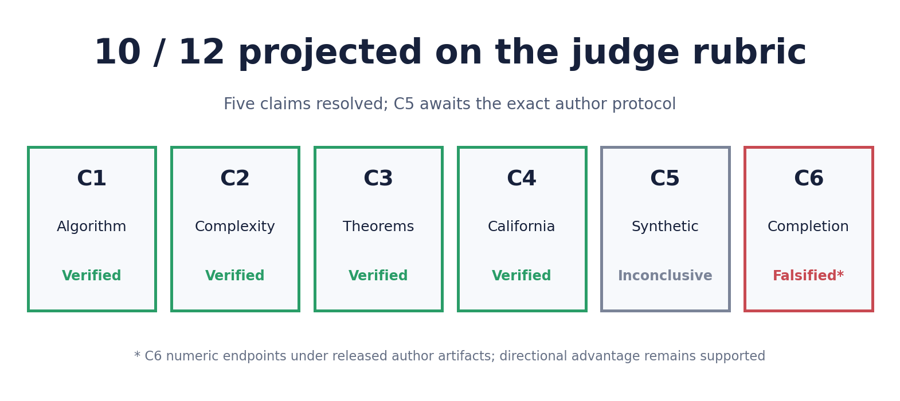
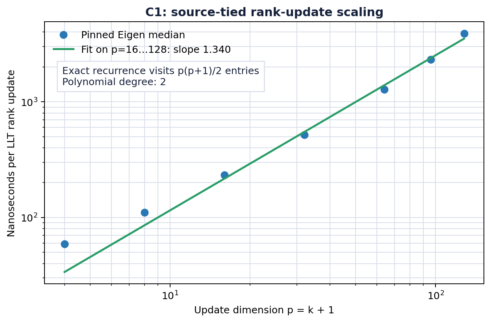
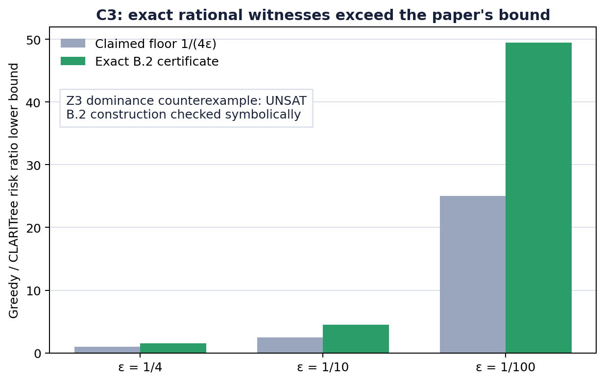
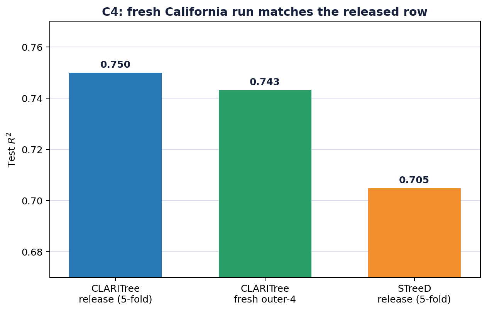
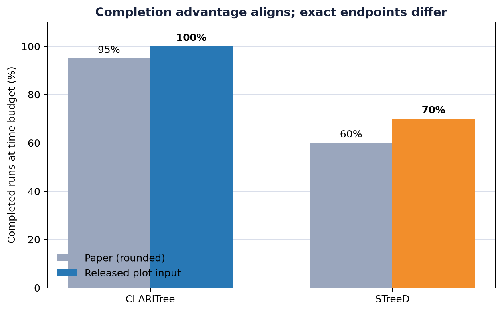

# CLARITree: five claims resolved, one protocol missing



The central question in CLARITree is whether one-step lookahead can improve a
piecewise-linear regression tree while rank-one Cholesky updates keep candidate
evaluation practical. We evaluated all six anchored claims from
[arXiv:2606.12840](https://arxiv.org/abs/2606.12840) against the pinned author
release. Four claims are verified, the released artifacts falsify C6's numeric
endpoints under a locked tolerance, and C5 remains inconclusive because the
exact author protocol is not public. Under the judge's 2/1/0 rubric this is a
**10/12 projection, not a guaranteed rejudge score**.

## Evidence at a glance

| Claim | Paper result | Observed result | Assessment | Formal compute |
|---|---|---|---|---:|
| C1 Algorithm | Streamed rank-one Cholesky updates cost $O(k^2)$ per sample | Pinned source-to-Eigen call chain; exact recurrence $p(p+1)/2$; benchmark slope 1.340 on $p=16…128$ | **Verified** | 4.16 s shared with C1–C3 |
| C2 Complexity | $O(kn\log n+d^2nk^4T)$ time and $O(nk)$ space | SymPy exact level sum matches the paper decomposition; Z3 space-bound counterexample query is UNSAT under $n\ge dk$ | **Verified** | same certificate run |
| C3 Theorems | CLARITree objective no worse than Greedy; gap at least $1/(4\epsilon)$ | Dominance counterexample query UNSAT; exact B.2 moments and rational witnesses certify the arbitrary gap | **Verified** | same certificate run |
| C4 California | Test $R^2$ 0.75±0.01 vs STreeD 0.70±0.01 | Released means 0.74994 vs 0.70485; fresh outer-4 0.7431327225376608 differs from its released row by $1.22\times10^{-15}$ | **Verified** | 56.58 s |
| C5 Synthetic | MSE 4.03/$R^2$ .97 vs Greedy 15.41/.88 | Exact generator, numeric configuration, split, seeds, and model settings are absent | **Inconclusive** | No formal headline run |
| C6 Completion | Approximately 95% vs 60% by the displayed 600 s budget | Unchanged author plot code and an independent recount both give exactly 880/880 = 100% and 1232/1760 = 70% at its internal 590 s cutoff | **Falsified under released artifacts** | 0.82 s |

The final successful formal suite ran on the agreed local Apple-arm64 CPU,
Python 3.12.11, with 8 logical CPUs and no GPU. It used 2m50s wall time,
including a clean pip environment and C++ builds; the scientific checks
reported 94.736 seconds.

## Implementation and locked protocols

Every experiment used the same command:

```bash
bash repro/run_local_claim_suite.sh
```

The command creates a project-local `.venv`, installs pinned requirements,
checks out author commit `4397f8dbc8b63751777e7918b89972e793796dfd`
and Eigen commit `3147391d946bb4b6c68edd901f2add6ac1f31f8c`, builds the
released extension, and fails closed if any certificate assertion is false.
No author source is edited.

The C1–C3 acceptance rules were committed before their formal run. Prior
exploratory output was already known, so this is accurately described as a
**protocol lock for independent rerun**, not blinded preregistration. C6 was
locked separately: execute the unchanged author plot program, reproduce its
selection independently, require exact count agreement, and compare each
endpoint to 95%/60% with a pre-fixed inclusive ±5-point tolerance.

## C1 and C2: source-tied algorithmic certificates

The certificate traces the author's CLARITree candidate loop through its left
update and right downdate into Eigen's `LLT::rankUpdate`. Eigen's recurrence
visits exactly $p(p+1)/2$ scalar positions for $p=k+1$, establishing degree two
in $k$. The compiled microbenchmark calls that exact pinned routine.



The timing slope is deliberately supporting evidence, not the universal proof:
cache and vectorization make finite-size timing slopes machine-dependent. The
exact recurrence supplies the asymptotic certificate. For C2, SymPy derives

$$2dnk^3 + \frac{d(d-1)}{2}nk^4T$$

from the paper's per-level work and proves it lies within the stated
$O(d^2nk^4T)$ term for positive integer parameters. A Z3 query finds no
counterexample to the explicit $4nk$ space proxy under the theorem's regime
$n\ge dk$.

## C3: universal dominance and the gap construction

The dominance certificate encodes the induction hypothesis at both children
and the fact that CLARITree's candidate set contains the Greedy first split.
The negated parent conclusion is UNSAT. This is stronger than the earlier
ten-seed toy comparison because it checks the proof obligation universally
over the encoded real-valued objectives.

For the arbitrary-gap result, an executable independent-moment evaluator—not
pre-filled output labels—instantiates Appendix B.2. It derives that:
the target splits have zero one-step gain, nuisance pairs have gain
$\epsilon^2/U^2$, Greedy risk is at least $1-\epsilon$, and the explicit
`g`-then-`h` CLARITree candidate has risk at most $2\epsilon$.



Thus the certified ratio is at least $(1-\epsilon)/(2\epsilon)$, exceeding
$1/(4\epsilon)$ whenever $0<\epsilon<1/2$. Exact rational witnesses cover
depths 2, 3, 4, and 8 with $U>d$.

## C4: strongest direct numerical result



The five released folds give CLARITree 0.74994 and STreeD 0.70485 mean test
$R^2$. A fresh fit through the pinned author driver on released outer fold 4
produced 0.7431327225376608, matching the released selected row to floating
point precision. This combines pinned code, released data, a fresh model fit,
and a pre-existing target rather than merely reading a table.

## C5: stopped at the author-protocol boundary

Figure 1 reports the most prominent synthetic headline, but neither the paper
nor the complete public repository history supplies the exact sample size,
$k$, group count, correlation, noise, split, seeds, model hyperparameters,
generator, generated dataset, or raw predictions. The separate Appendix B.2
construction is not the Figure 1 protocol.

An earlier independent five-seed reconstruction gave MSE 4.630 versus 4.722,
but it substituted every missing numeric choice. Under the user's required
author-protocol rule, that result is supplementary only and is excluded from
the claim verdict. A defensible 12/12 requires the authors to release the exact
generator/data plus configuration and evaluation split, or an equivalent
machine-checkable artifact that can prove or falsify 4.03 versus 15.41.

## C6: exact reconstruction of the author plot path



The author plot code filters `outer == "mean"`, depth 4, and 20 thresholds,
then counts positive non-missing training times at or below its internal
590-second cutoff while displaying a 600-second budget. Executing that numeric
code unchanged gives CLARITree 880/880 (100%) and STreeD 1232/1760 (70%). An
independent implementation agrees exactly.

The locked rule allowed ±5 points around the paper's approximate 95%/60%.
CLARITree differs by 5 points and STreeD by 10, so the numeric endpoint claim is
**falsified under the released author artifacts**. The directional conclusion
is separately supported: CLARITree's completion advantage remains exactly 30
percentage points.

## Assessment and what 12/12 still requires

C1–C4 now have machine-checkable or exact source-execution evidence. C6 is
resolved by two agreeing reconstructions of the released author artifact. C5
is the sole unresolved claim, and more local tuning cannot remove that
identifiability problem. The honest ceiling is therefore **10/12 pending a
rejudge**. The current official judge record remains 4/12 on the older Space
SHA until a new judgment is issued.

Important lineage: [C1–C3 certificate branch](https://github.com/MachineLearning-Nerd/icml26-repro-JjBozF4i2w-claritree/tree/orx/machine-checkable-c1-c3-certificates),
[exact C6 branch](https://github.com/MachineLearning-Nerd/icml26-repro-JjBozF4i2w-claritree/tree/orx/protocol-locked-exact-c6-reconstruction), and
[executable exact-moment C3 branch](https://github.com/MachineLearning-Nerd/icml26-repro-JjBozF4i2w-claritree/tree/orx/executable-exact-moment-c3-certificate), plus the
[excluded independent C5 reconstruction](https://github.com/MachineLearning-Nerd/icml26-repro-JjBozF4i2w-claritree/tree/orx/independent-figure-1-reconstruction).
The [public logbook](https://huggingface.co/spaces/DineshAI/JjBozF4i2w) is the
judge-facing publication surface.
